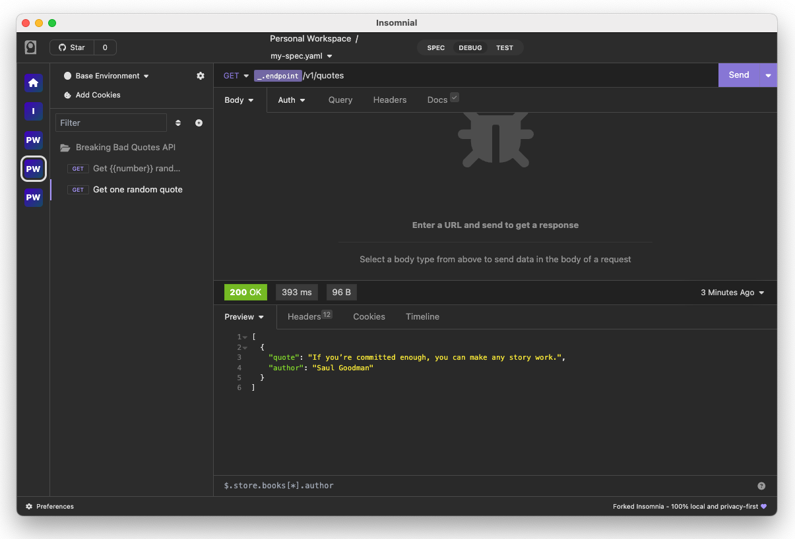

# Insomnial API Client

Insomnial is a 100% local and privacy-focus open-source API client for testing GraphQL, REST, WebSockets, Server-sent events and gRPC in development/production.

- ✅ works 100% offline, the way a local testing tool should behave <br>
- ✅ no cloud services, no tracking/communication to external servers behind the scene <br>




## Backstory

Insomnial is a fork of [Kong/insomnia at 2023.5.8](https://github.com/Kong/insomnia), the last version before compulsory account login was introduced. 
I was among the users who were deeply affected by the recent changes. Essentially, Insomnia is still a nice product in general, but due to the fact that I love everything to be local unless it's explicitly to be on cloud. Hence, I have decided to fork it and make it **100% local and privacy-focus** for my personal use.

**And I haven't ever never have any intention to sell or make this as a commercial product to benefit myself.**

## Roadmap

I have removed user login, tracking, analytics, etc., from Insomnia, so it is now a 100% local app. (And runs much faster!)

## Download

Insomnial is available for Mac, Windows, Ubuntu, Debian, CentOS, Fedora and [can be downloaded here](https://github.com/kobenguyent/insomnial/releases).

Alternatively, you can build Insomnial from source on your local machine using `npm run app-package`.

## Migration from Insomnia

You can use the GUI (under `Preferences/Data`) or directly e.g. for MacOS `cp -r ~/Library/Application\ Support/Insomnia ~/Library/Application\ Support/Insomnial`. 

Development on Insomnial can be done on Mac, Windows, or Linux as long as you have [Node.js](https://nodejs.org) and [Git](https://git-scm.com/). See the `.nvmrc` file located in the project for the correct Node version.

<details>
<summary>Initial Dev Setup</summary>

This repository is structured as a monorepo and contains many Node.JS packages. Each package has its own set of commands, but the most common commands are available from the root [`package.json`](package.json) and can be accessed using the `npm run …` command. Here are the only three commands you should need to start developing on the app.

```shell
# Install and Link Dependencies
npm i

# Run Lint
npm run lint

# Run type checking
npm run type-check

# Run Tests
npm test

# Start App with Live Reload
npm run dev
```

### Linux

If you are on Linux, you may need to install the following supporting packages:

<details>
<summary>Ubuntu/Debian</summary>

```shell
# Update library
sudo apt-get update

# Install font configuration library & support
sudo apt-get install libfontconfig-dev
```

</details>

<details>
<summary>Fedora</summary>

```shell
# Install libcurl for node-libcurl
sudo dnf install libcurl-devel
```

</details>

Also on Linux, if Electron is failing during the installation process, run the following

```shell
# Clear Electron install conflicts
rm -rf ~/.cache/electron
```

### Windows

If you are on Windows and have problems, you may need to install [Windows Build Tools](https://github.com/felixrieseberg/windows-build-tools)

</details>

<details>
<summary>Editor Requirements</summary>

You can use any editor you'd like, but make sure to have support/plugins for the following tools:

- [ESLint](http://eslint.org/) - For catching syntax problems and common errors
- [JSX Syntax](https://facebook.github.io/react/docs/jsx-in-depth.html) - For React components

</details>

## Bugs and Feature Requests

Before submitting a bug or a feature request, you can read the
[issue guidelines](CONTRIBUTING.md#using-the-issue-tracker).

## Contributing

Please read through our [contributing guidelines](CONTRIBUTING.md). Included are directions for opening issues, coding standards, and notes on development.

## License

[MIT](LICENSE)
